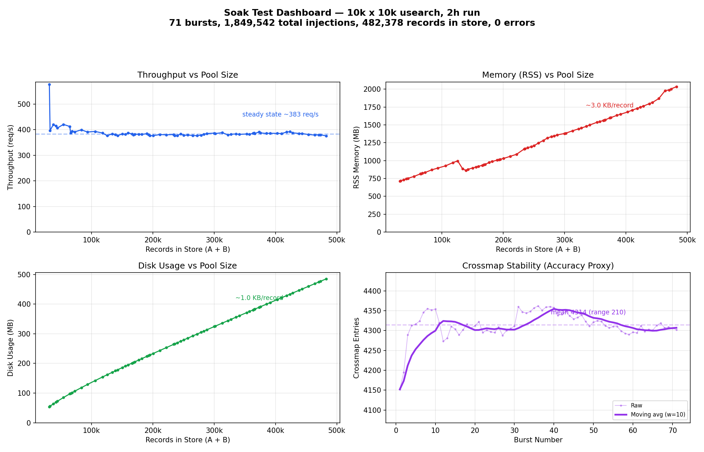

← [Back to Index](./) | [Configuration](configuration.md) | [Building](building.md)

# Performance

## Overview

Benchmarked on Apple M3 MacBook Air, `all-MiniLM-L6-v2` model,
`encoder_pool_size: 4`.

## Batch mode performance

`flat` scans all candidates linearly; `usearch` uses an HNSW
approximate nearest-neighbour (ANN) graph for O(log N) candidate
selection. Cold builds encode vectors from scratch and save them to
disk; every subsequent run is warm. Both backends use `country_code`
blocking.

10k x 10k means 10,000 records on each side with zero initial
crossmappings.

| | flat 10k x 10k | usearch 10k x 10k | flat 100k x 100k | usearch 100k x 100k |
|---|---:|---:|---:|---:|
| Index build time (no cache) | ~17s | ~17s | ~3m | ~3m 32s |
| Index load time (cached) | ~47ms | ~78ms | ~650ms | ~235ms (A) + ~261ms (B) |
| Scoring throughput | 5,507 rec/s | **33,738 rec/s** | — | **10,539 rec/s** |
| Wall time (cold) | — | — | — | 3m 32s |
| Wall time (warm) | 2.2s | 0.3s | — | **9.5s** |

> [!TIP]
> The first build of cached indices for large datasets can be slow —
> vector encoding is compute-intensive. If this is a problem, set
> `quantized: true` in the `performance` section to roughly double
> encoding speed. Thereafter, pre-built indices on disk are reused
> and startup is fast.

- The `flat` backend is file-based with O(N) search performance. Use
  only for small experiments and development.
- The `usearch` backend is an in-process HNSW vector database with
  O(log N) search. Use for any real-world workload.

## BM25-only batch mode

BM25 + fuzzy + exact scoring, `country_code` blocking. The BM25-only
fast path queries the Tantivy index directly with blocking filters,
avoiding the need to fetch all blocked records.

10k × 10k:

| Metric | In-memory | SQLite |
|---|---:|---:|
| Bulk load | — | 170–194K rec/s |
| Scoring throughput | **49,337 rec/s** | 2,099 rec/s |
| Auto-matched | 7,824 | 7,931 |
| Peak memory | ~2 GB | ~1.2 GB |

1M × 1M (in-memory, `bm25_candidates: 10`):

| Metric | Value |
|---|---:|
| Scoring throughput | **1,062 rec/s** |
| Projected full run | ~16 minutes |

The in-memory vs SQLite gap is larger for BM25-only than for embedding
pipelines because the in-memory BM25 fast path queries Tantivy and
fetches only the top survivors — no bulk record loading. SQLite batch
mode trades throughput for bounded memory: at 55M scale where in-memory
needs ~15-20 GB, SQLite keeps memory at ~10-12 GB.

## Live mode performance

Pre-populated caches (10k x 10k). `c=1` means one HTTP client
submitting 3,000 requests sequentially. `c=10` means ten concurrent
clients each submitting 3,000 requests (30k total). 80% of requests
require ONNX encoding; 20% modify only non-embedding fields and skip
the model entirely.

| Metric | flat (c=10) cold | usearch (c=10) cold | flat (c=10) warm | usearch (c=10) warm |
|--------|----------------:|--------------------:|-----------------:|--------------------:|
| Throughput | 843 req/s | 1,045 req/s | 1,113 req/s | **1,558 req/s** |
| p50 latency | 8.4ms | 5.5ms | 7.2ms | 3.5ms |
| p95 latency | 30.4ms | 29.0ms | 21.2ms | 25.6ms |

Cold = fresh index build on startup. Warm = pre-built cache loaded from disk (~1.7s startup vs ~18s cold).

At 100k x 100k (80% encoding, c=10, 10k events), usearch reaches **1,325 req/s** warm
with p50 latency of 6.0ms and p95 of 19.0ms.

### SQLite live mode

Pre-populated caches (10k x 10k), usearch, warm start, c=10, 10k events:

| Metric | In-memory | SQLite |
|--------|----------:|-------:|
| Throughput | 1,698 req/s | **1,395 req/s** |
| p50 latency | 3.4ms | 6.4ms |
| p95 latency | 23.9ms | 13.6ms |
| p99 latency | 37.3ms | 20.3ms |

SQLite is ~18% slower on throughput but has better tail latency (p95/p99).
The trade-off is durability and instant warm restarts (~0.4s vs ~18s for
in-memory cold start).

## Low-encoding-ratio performance

When fewer requests require encoding (40% instead of 80%), throughput
improves further: the text-hash skip optimisation means non-encoding
requests complete in under 1ms.

| Metric (40% encoding) | flat (c=10) | usearch (c=10) |
|--------|------------:|---------------:|
| Throughput | 890 req/s | **2,474 req/s** |
| p50 latency | 10.1ms | 2.4ms |
| p95 latency | 21.0ms | 11.1ms |

## Soak test — stability under sustained load

A 2-hour soak test validates that the live server remains stable under
continuous injection pressure: no memory leaks, no throughput
degradation, no scoring drift, and zero errors.

### Test setup

- **Hardware**: Apple M1 Ultra (20 cores, 64 GB RAM)
- **Base pool**: 10k x 10k records, usearch backend, `all-MiniLM-L6-v2`
- **Scoring**: embedding (0.55) + BM25 on address fields (0.40) + exact LEI (0.05)
- **Blocking**: AND on country_code/domicile
- **Concurrency**: 10 HTTP workers, `encoder_pool_size: 4`
- **Injection mix**: ~25% new records, ~75% upserts (embedding mutations,
  field-only mutations). New records are synthetic with no true match on
  the opposite side.
- **Sleep between bursts**: 10–60 seconds (randomised)

### Results summary

| Metric | Value |
|--------|-------|
| Duration | 2 hours |
| Bursts completed | 71 |
| Total injections | 1,849,542 |
| Final pool size | 482,378 (241k per side, up from 10k base) |
| Errors | **0** |
| Steady-state throughput | ~383 req/s |
| Memory growth | 714 → 2,035 MB (~3.0 KB per new record) |
| Disk growth | 54 → 485 MB (~1.0 KB per new record) |
| Crossmap entries | mean 4,314 (range 210) |

### Dashboard



All four charts show near-ideal behaviour:

**Throughput vs pool size** — after an initial burst at 577 req/s (small
pool), throughput settles at ~383 req/s and stays flat despite the pool
growing from 31k to 482k total records (a 15× increase). The AND
blocking strategy bounds scoring cost by block size rather than total
pool size, which is why throughput barely moves.

**Memory vs pool size** — linear growth at ~3.0 KB per new record with
no sign of a leak. Upserts to existing records do not grow memory. The
visible dip around 130k records is an OS-level artifact: macOS
aggressively compresses inactive memory pages during the sleep intervals
between bursts. When subsequent bursts touch those pages again (scoring
reads from the full pool), the OS decompresses them and RSS climbs back
to the trendline. This is not application behaviour — the underlying
allocations are unchanged.

**Disk vs pool size** — perfectly linear at ~1.0 KB per new record.
This covers the WAL (append-only event log), usearch HNSW index growth,
and crossmap CSV. No WAL bloat or runaway growth.

**Crossmap stability** — the crossmap tracks confirmed 1:1 match pairs
(A↔B). This chart is an accuracy proxy: if scoring were degrading under
load (e.g. due to index corruption, vector drift, or blocking index
inconsistency), the crossmap count would trend downward as upserts
break pairs that can no longer re-confirm.

The ~4,300 confirmed pairs come from the original 10k x 10k base data
that genuinely match. Synthetic new records are random and have no true
counterpart, so they almost never reach the 0.85 auto-match threshold.
What we observe is equilibrium: upserts with mutated fields temporarily
break existing pairs, re-scoring mostly re-confirms them, and the small
number that don't re-confirm are offset by occasional new pair
formation. The 10-burst moving average stays within 1.5% of the mean
across the full 2-hour run — no drift.

### Running the soak test

```bash
cargo build --release --features usearch
python3 benchmarks/soak/10kx10k_usearch/run_test.py --duration 2
```

Shorter runs for quick validation:

```bash
python3 benchmarks/soak/10kx10k_usearch/run_test.py --duration 0.5 --min-sleep 10 --max-sleep 60
```

Results are written to `benchmarks/soak/10kx10k_usearch/soak_log.csv`.
The server log is at `/tmp/meld_soak_<pid>.log`. The script cleans all
test artifacts (cache, WAL, crossmap, output, soak log) before each
run, but does not clean the `/tmp/` server log.

## Benchmarking

Each benchmark is a self-contained directory with its own `config.yaml` and
`run_test.py`. All scripts require only the Python standard library — no pip
dependencies.

### Running individual tests

```bash
# Single batch test — run from the project root
python3 benchmarks/batch/10kx10k_usearch/cold/run_test.py
python3 benchmarks/batch/10kx10k_usearch/warm/run_test.py

# Single live test
python3 benchmarks/live/10kx10k_inject3k_usearch/cold/run_test.py
python3 benchmarks/live/100kx100k_inject10k_usearch/warm/run_test.py
```

Cold tests wipe their cache and rebuild from scratch. Warm tests preserve the
cache — run them twice if the cache is empty: the first run builds it, the
second is the true warm measurement.

### Running the full suite

> [!WARNING]
> A full suite run takes a long time. The 100k cold tests alone encode
> 200,000 records through the ONNX model (~3.5 minutes each). Expect
> **45–60 minutes** for all batch tests and **60–90 minutes** for all live
> tests on Apple Silicon. Budget accordingly.

```bash
# All batch benchmarks (cold then warm for each size/backend)
python3 benchmarks/batch/run_all_tests.py

# All live benchmarks (cold then warm for each size/backend)
python3 benchmarks/live/run_all_tests.py
```

Both scripts stream each test's output to the terminal as it runs, then print
a summary table at the end. Because cold tests build the embedding cache, the
immediately following warm test needs only one pass — the cache is already hot.

### Helper scripts

Four scripts in `benchmarks/scripts/` exercise the live server directly and
can start/stop it automatically or connect to one you already have running
(`--no-serve`):

**`benchmarks/scripts/smoke_test.py`** — Quick sanity check. Starts the server,
sends 10 upsert requests, prints each response with latency, and stops.
Use this to verify the server comes up cleanly before running longer tests.

```bash
python3 benchmarks/scripts/smoke_test.py --binary ./target/release/meld \
    --config benchmarks/live/10kx10k_inject3k_usearch/warm/config.yaml
```

**`benchmarks/scripts/live_stress_test.py`** — Sequential throughput and latency.
Fires N requests one at a time with a realistic operation mix (30% new
A, 30% new B, 20% embedding updates, 20% non-embedding updates). Prints
p50/p95/p99/max latency per operation type and overall throughput.

```bash
python3 benchmarks/scripts/live_stress_test.py --binary ./target/release/meld \
    --config benchmarks/live/10kx10k_inject3k_usearch/warm/config.yaml \
    --iterations 3000
```

**`benchmarks/scripts/live_concurrent_test.py`** — Concurrent throughput. Same
operation mix but distributed across N parallel workers. Use this to
measure how throughput scales under load.

```bash
python3 benchmarks/scripts/live_concurrent_test.py --binary ./target/release/meld \
    --config benchmarks/live/10kx10k_inject3k_usearch/warm/config.yaml \
    --iterations 3000 --concurrency 10
```

**`benchmarks/scripts/live_batch_test.py`** — Batch endpoint benchmark. Runs the
same workload through single-record and batch endpoints, printing a
side-by-side comparison. Use `--batch-only` to skip the single-record
baseline.

```bash
python3 benchmarks/scripts/live_batch_test.py --binary ./target/release/meld \
    --config benchmarks/live/10kx10k_inject3k_usearch/warm/config.yaml \
    --records 3000 --batch-size 50
```

All four scripts accept `--no-serve` to skip starting the server:

```bash
# Terminal 1: start the server manually
meld serve --config benchmarks/live/10kx10k_inject3k_usearch/warm/config.yaml --port 8090

# Terminal 2: run the benchmark against it
python3 benchmarks/scripts/live_concurrent_test.py --no-serve --port 8090 --iterations 3000
```
